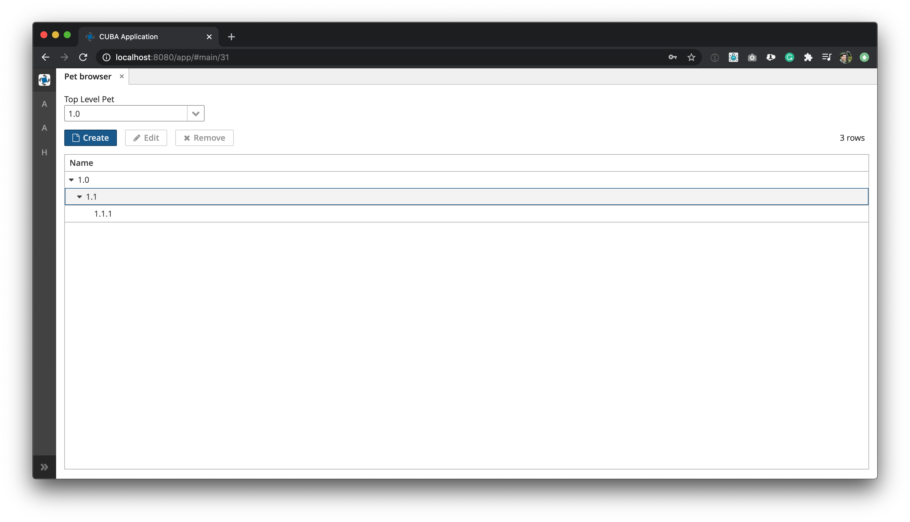
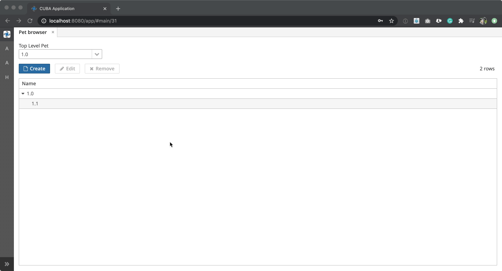

# cuba-example-treefilter

This example shows how to filter for a top level object in a tree structure in order to limit the amount of entries to show in a tree table:

## Filtered Browse Screen

## Overview

